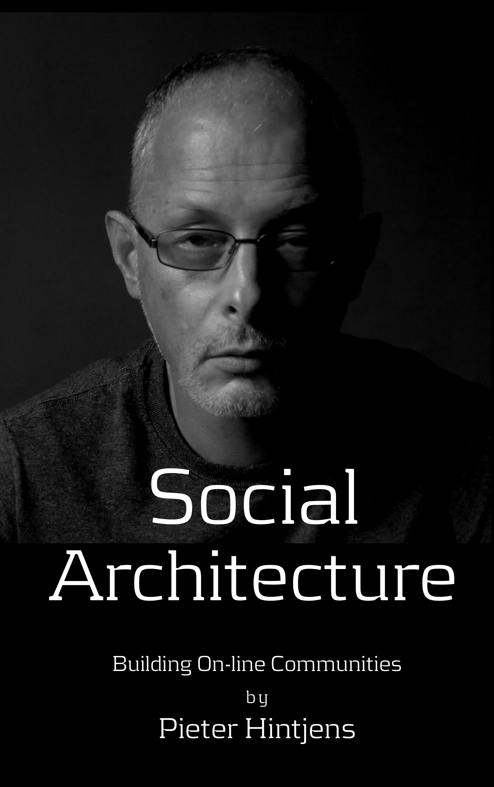

= Социальная Архитектура: Создание онлайн сообществ
:author: Питер Хинченс
:email: pieter@hintjens.com
:doctype: book
:toc: left
:toclevels: 2
:toc-title: Содержание
:sectnums:
:sectnumlevels: 2
:chapter-label!:
:appendix-caption!:

--
ifndef::backend-html5[]
- https://irus.github.io/social-architecture-ru/[Читать книгу в браузере]
endif::[]
ifndef::backend-pdf[]
- https://irus.github.io/social-architecture-ru/social-architecture-ru.pdf[Скачать PDF]
endif::[]
ifndef::backend-epub3-xhtml5[]
- https://irus.github.io/social-architecture-ru/social-architecture-ru.epub[Скачать Epub]
endif::[]
- https://github.com/IRus/social-architecture-ru[Репозиторий на Github]
--

include::dedication.adoc[leveloffset=+1]

include::ch0.adoc[leveloffset=+1]

include::ch1.adoc[leveloffset=+1]

include::ch2.adoc[leveloffset=+1]

include::ch3.adoc[leveloffset=+1]

include::ch4.adoc[leveloffset=+1]

include::ch5.adoc[leveloffset=+1]

include::ch6.adoc[leveloffset=+1]

include::ch7.adoc[leveloffset=+1]

include::colophon.adoc[]

include::author.adoc[leveloffset=+1]

include::copyright.adoc[leveloffset=+1]

include::about.adoc[leveloffset=+1]
